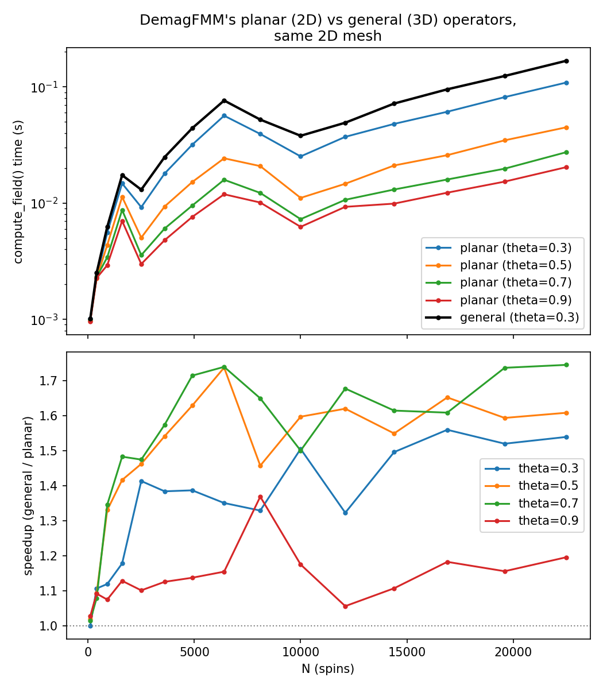
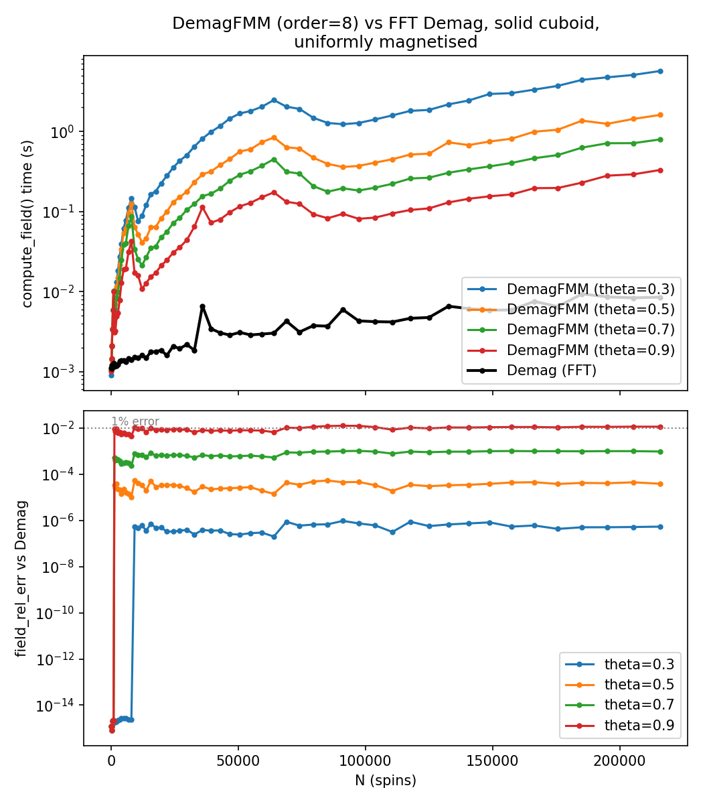
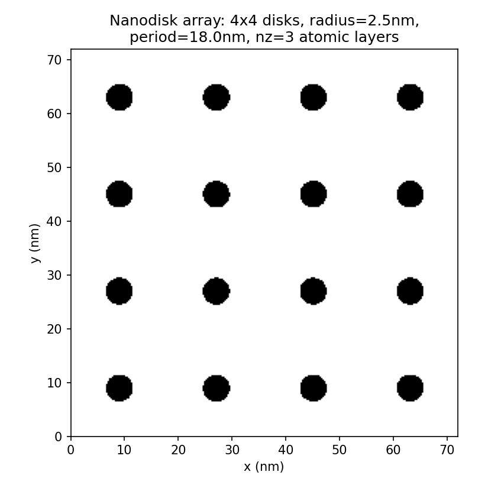
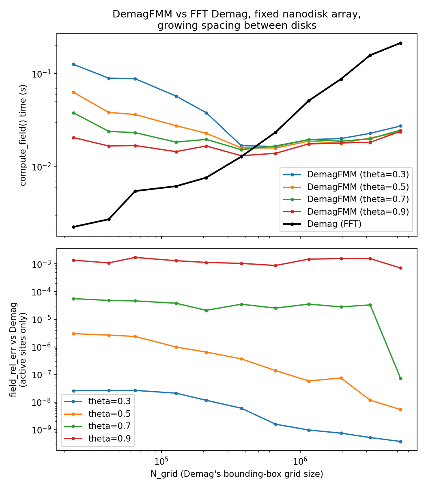

FMM/Barnes-Hut Demagnetising Field
==================================

The dipolar (demagnetising, stray field) interaction, defined in
:doc:`core_eqs`, is a sum over every pair of spins in the system, so a direct
evaluation costs :math:`O(N^2)` per field update. Fidimag offers two ways of
avoiding that cost for atomistic simulations: ``Demag``, which uses OOMMF's
FFT convolution, and ``DemagFMM``, which uses a Fast Multipole Method (FMM)
or Barnes-Hut (BH) tree. Both live in ``fidimag/atomistic/demag.py``.

FFT-based Demag
----------------

``Demag`` only works on a ``CuboidMesh``: the regular, translationally
invariant lattice lets the pairwise interaction be written as a convolution
of the spin configuration with a fixed dipolar tensor, which is then
evaluated with an FFT. This is what most atomistic simulations use day to
day, and it is very fast, but it needs the mesh to be a full rectangular
grid, including every non-magnetic (:math:`\mu_s=0`) site inside the padded
region - there is no way to leave a site out of the grid.

The Barnes-Hut and Fast Multipole Methods
-------------------------------------------

Both BH and FMM approximate the same quantity: the per-site dipolar field
of :doc:`core_eqs`,

.. math::
   \vec{H}_i = \frac{\mu_0}{4\pi} \sum_{j \neq i}
   \frac{3\hat{\vec{r}}_{ij}(\vec{\mu}_j \cdot \hat{\vec{r}}_{ij}) - \vec{\mu}_j}{r_{ij}^3},

with :math:`\vec{\mu}_j = \mu_s \vec{S}_j` the magnetic moment at site
:math:`j`, without evaluating every pair :math:`(i, j)` directly. They do
this with a hierarchical approximation, following Visscher and Apalkov's
recursive formulation for dipolar sums [1]_. Spins are recursively grouped
into an octree: starting
from one cell containing every spin, a cell is split into eight octants
once it holds more than ``ncrit`` spins, and this repeats until every leaf
holds at most ``ncrit`` spins. A group of spins far enough from a given
evaluation point is then replaced by a single truncated multipole
expansion of order ``p`` (fidimag's ``order`` argument) rather than summed
one by one, which is what gives the tree methods their better-than-
:math:`O(N^2)` scaling.

"Far enough" is decided by a multipole acceptance criterion, and the two
methods differ in how they apply it and what they do once a group is
accepted. Barnes-Hut compares a cell directly against the evaluation point:
a cell of radius :math:`r_{\text{cell}}` at distance :math:`|\mathbf{x}_p -
\mathbf{x}_c|` from a target point is accepted once

.. math::
   \frac{r_{\text{cell}}}{|\mathbf{x}_p - \mathbf{x}_c|} < \theta,

at which point its multipole expansion is evaluated directly at the target
(an M2P operator). The full FMM instead compares cell against cell: two
cells of radius :math:`r_{c_A}`, :math:`r_{c_B}` separated by :math:`R` are
accepted once

.. math::
   \frac{r_{c_A} + r_{c_B}}{R} < \theta,

at which point the source cell's multipole expansion is translated into a
*local* expansion centred on the target cell (an M2L operator), valid for
every spin inside it at once. A well-separated pair of large groups is
therefore visited once by FMM regardless of how many spins each contains,
where BH would still visit the target group's spins one at a time; FMM is
consequently the better-scaling method; that a cell-cell test and a
particle-cell test are not directly comparable also means, per Visscher and
Apalkov, that matching accuracy between the two needs roughly
:math:`\theta_{\text{FMM}} \approx 2\,\theta_{\text{BH}}`, worth keeping in
mind when switching ``type`` without also revisiting ``theta``.

Both methods, therefore, are controlled by the same three parameters:

- ``order`` - the truncation order :math:`p` of the multipole/local
  expansions. Higher order is more accurate and more expensive per
  interaction. Valid values are whatever
  ``fidimag/atomistic/fmmlib/operators.cpp`` was generated for, exposed as
  ``fidimag.extensions.fmm.MINORDER``/``MAXORDER`` (currently orders 2 to
  12 inclusive); ``DemagFMM`` validates against these directly.
- ``ncrit`` - the maximum number of spins in a tree leaf before it is
  subdivided further.
- ``theta`` - the multipole acceptance criterion above. ``theta=0.0``
  disables the approximation entirely and falls back to an exact pairwise
  sum (used as the correctness baseline in ``tests/test_demag_fmm.py``);
  larger ``theta`` accepts coarser, faster, less accurate approximations
  further down the tree.

and the choice between them is fidimag's ``type`` argument: ``type='fmm'``
(the default) for the full FMM, ``type='bh'`` for Barnes-Hut.

Multipole and local expansions
~~~~~~~~~~~~~~~~~~~~~~~~~~~~~~~

The expansions themselves come from Taylor-expanding the Green's function
of Laplace's equation, :math:`\phi(\vec{r}) = 1/|\vec{r}|`, about a cell
centre; this is the same :math:`1/r` that already appears in :math:`\vec{H}_i`
above, generalised so that its derivatives can be taken once per cell
rather than once per pair. Using multi-index notation for a triple
:math:`\mathbf{n} = (n_x, n_y, n_z)`, with :math:`\mathbf{r}^{\mathbf{n}} =
x^{n_x} y^{n_y} z^{n_z}` and :math:`\mathbf{n}! = n_x!\, n_y!\, n_z!`, a
source at :math:`\mathbf{x}_a` has multipole moments about a cell centre
:math:`\mathbf{z}_A`

.. math::
   \mathbf{M}_{\mathbf{n}}(\mathbf{z}_A) = \sum_{|\mathbf{k}|=0}^{p-|\mathbf{n}|}
   \frac{(\mathbf{z}_A - \mathbf{x}_a)^{\mathbf{k}}}{\mathbf{k}!}\, \mathcal{S}_{\mathbf{n}-\mathbf{k}},

where :math:`\mathcal{S}` are the source's own moments (this is the P2M
operator). A dipole source, which is what a magnetic moment is, has
:math:`\mathcal{S}_{(1,0,0)}=\mu_x`, :math:`\mathcal{S}_{(0,1,0)}=\mu_y`,
:math:`\mathcal{S}_{(0,0,1)}=\mu_z` and every other moment zero; fmmgen
calls this minimum order the *source order*, ``source_order=1`` for
fidimag's magnetic moments (``source_order=0`` would be a point charge,
``2`` a quadrupole, and so on). When a cell is subdivided, a child's
moments are shifted to the parent's centre :math:`\mathbf{z}_A'` by the
M2M operator

.. math::
   \mathbf{M}_{\mathbf{n}}(\mathbf{z}_A') = \sum_{|\mathbf{k}|=0}^{p-|\mathbf{n}|}
   \frac{(\mathbf{z}_A - \mathbf{z}_A')^{\mathbf{k}}}{\mathbf{k}!}\, \mathbf{M}_{\mathbf{n}-\mathbf{k}}(\mathbf{z}_A).

Once a source cell at :math:`\mathbf{z}_A` and target cell at
:math:`\mathbf{z}_B` satisfy the FMM acceptance criterion, the M2L operator
converts the source's multipole expansion into a local expansion about the
target's centre,

.. math::
   \mathbf{L}_{\mathbf{n}}(\mathbf{z}_B) = \sum_{|\mathbf{m}|=0}^{p-|\mathbf{n}|-s}
   (-1)^{\mathbf{n}}\, \mathbf{M}_{\mathbf{m}}(\mathbf{z}_A)\, \nabla^{\mathbf{n}+\mathbf{m}}\phi(\mathbf{z}_B - \mathbf{z}_A),

with :math:`s` the source order. Every spin at position :math:`\vec{x}_b`
in the target cell then reads the potential from this one local expansion
(the L2P operator),

.. math::
   \phi(\vec{x}_b) \approx \sum_{|\mathbf{n}|=s}^{p} \frac{1}{\mathbf{n}!}
   (\vec{x}_b - \vec{z}_B)^{\mathbf{n}}\, \mathbf{L}_{\mathbf{n}}(\vec{z}_B),

rather than the source cell's multipole expansion directly. Fidimag needs
the field, not the potential, which L2P gets by differentiating the same
local expansion instead of evaluating it directly: for a derivative
:math:`\mathbf{k}` (a unit multi-index, e.g. :math:`(1,0,0)` for
:math:`\partial/\partial x`),

.. math::
   \frac{\partial^{\mathbf{k}}\phi}{\partial \vec{r}^{\mathbf{k}}}\bigg|_{\vec{x}_b}
   \approx \sum_{|\mathbf{n}|=s+|\mathbf{k}|}^{p} \frac{1}{(\mathbf{n}-\mathbf{k})!}
   (\vec{x}_b - \vec{z}_B)^{\mathbf{n}-\mathbf{k}}\, \mathbf{L}_{\mathbf{n}}(\vec{z}_B),

giving one field component (:math:`H_x`, :math:`H_y` or :math:`H_z`) per
choice of :math:`\mathbf{k}`. A Barnes-Hut-accepted cell skips straight to
this last step, differentiating the source cell's *multipole* expansion at
the target point itself (M2P) with no local expansion in between.

Symbolic operator generation
~~~~~~~~~~~~~~~~~~~~~~~~~~~~~

The number of terms in a multipole expansion of order :math:`p` grows as
:math:`p(p+1)/2` (more, once a nonzero source order or the trace-free basis
below is factored in), which Pepper and Fangohr note becomes tedious to
hand-derive correctly beyond about third order [2]_, and previously made
supporting an arbitrary source order (monopole, dipole, quadrupole, ...) in
one codebase impractical, forcing separate hand-written implementations
per case. `fmmgen <https://github.com/rpep/fmmgen>`_ instead derives the
P2M/M2M/M2L/L2P/M2P operators symbolically with SymPy for whatever order
and source order are requested, and emits optimised C/C++ from the result
- common subexpression elimination, and exploiting the Laplace equation's
harmonicity (:math:`\nabla^{\mathbf{n}+(0,0,2)}\phi = -\nabla^{\mathbf{n}+(2,0,0)}\phi -
\nabla^{\mathbf{n}+(0,2,0)}\phi`) to compute some derivatives from others rather
than symbolically from scratch, among other passes.

The generated code
(``fidimag/atomistic/fmmlib/operators.cpp``/``.h``) is committed directly
into the repository and compiled as part of the normal CMake build; fmmgen
itself is a build-time code generator, not a runtime dependency of
fidimag.

Harmonic compression
~~~~~~~~~~~~~~~~~~~~~

By default (``compressed=True``), ``DemagFMM`` uses fmmgen's trace-free
("harmonic-compressed") basis for the multipole and local expansions,
rather than the plain Cartesian tensor basis above. The two are
algebraically identical, but the compressed basis has :math:`(p+1)^2`
coefficients at order :math:`p` instead of the uncompressed
:math:`\binom{p+3}{3}`, which substantially reduces the operation count of
the M2L step - the dominant cost at high expansion order. See Coles and
Bieri for the derivation of the reduction fmmgen implements [3]_.

Usage
-----

``DemagFMM`` is added to a simulation the same way as any other
interaction::

    from fidimag.atomistic import Sim, DemagFMM
    from fidimag.common import CuboidMesh
    import fidimag.common.constant as const

    mesh = CuboidMesh(nx=20, ny=20, nz=20, dx=0.3, dy=0.3, dz=0.3,
                       unit_length=1e-9)
    sim = Sim(mesh)
    sim.set_mu_s(2 * const.mu_B)
    sim.add(DemagFMM(order=5, ncrit=128, theta=0.5))

There is no separate driver keyword to pick ``DemagFMM`` over ``Demag`` -
they are both ordinary ``Energy`` interactions, and either or both can be
added to a simulation.

2D systems
----------

A 2D mesh (``CuboidMesh`` with ``nz=1``) has every site at the same z, so
only relative (x, y) displacements ever enter the field calculation
between them - the tree does not need a z column at all, whatever that
shared z actually is. fmmgen's planar operator variant
(``generate_code(..., planar=True)``) drops the multipole/local terms that
are always zero once every source and target has z=0; this is not a
further approximation on top of ``order``/``theta``, since a 2D mesh's
sites genuinely satisfy that condition exactly. ``DemagFMM`` detects a 2D
mesh and uses the planar variant automatically - no separate argument is
needed to ask for it.

``benchmarks/demag_fmm_2d_vs_general.py`` times the planar variant against
the general one on the same 2D mesh, for :math:`L \times L` meshes up to
:math:`N=22{,}500`. The planar variant is consistently faster, by 1.3x to
1.7x depending on ``theta``, since the reduction is a fixed cut in
operation count per interaction rather than a change in scaling.

Performance
-----------

``benchmarks/demag_fmm_vs_fft.py`` times a single ``compute_field()`` call
for ``DemagFMM`` against ``Demag``, on cubic :math:`L\times L\times L`
atomistic cuboid meshes, sweeping :math:`L` from 5 to 60 (:math:`N=125` to
:math:`N=216{,}000` spins) and ``theta`` over 0.3, 0.5, 0.7 and 0.9, at
``order=8``. The bottom panel is the relative field error against
``Demag``, a free byproduct of timing both on the same spin configuration.

At the smallest size tested (:math:`N=125`), ``DemagFMM`` and ``Demag``
take about the same time. From there the gap widens steadily with
:math:`N`: at the largest size tested, ``DemagFMM`` is slower than
``Demag`` by a factor of about 28x at ``theta=0.7`` and about 740x at
``theta=0.3``, and still widening. This is not a surprising result: a
solid cuboid is exactly the geometry the FFT convolution is designed for,
with full translational symmetry and no wasted grid sites, so it is a
genuinely unfavourable comparison for the tree method. Accuracy degrades
smoothly as ``theta`` loosens, from :math:`5\times10^{-7}` at ``theta=0.3``
to about 1.1% at ``theta=0.9``, both essentially independent of :math:`N`
over the range tested.

Where FMM/Barnes-Hut is worth it
---------------------------------

The FFT method's restriction to a ``CuboidMesh`` is fundamental, not
incidental - the convolution relies on translational symmetry across a
regular grid. ``DemagFMM`` has no such restriction in principle: it
operates on a list of spin positions, not a grid, so it is the natural
route to supporting demagnetising fields on irregular or non-cuboid
meshes in the future.

There is also a more immediate benefit even on ``CuboidMesh``. The FFT
method must pad and transform the full grid, including every non-magnetic
(:math:`\mu_s=0`) site - a patterned sample with large non-magnetic gaps
pays the same grid cost as a solid block of the same bounding box.
``DemagFMM`` does not: it builds its tree only from the sites with
``mu_s != 0``, so its cost tracks the number of magnetic sites rather than
the size of the bounding box they sit in. ``mu_s=0`` sites are returned at
exactly zero field, since they carry no moment and never needed one
evaluated at them.

``benchmarks/demag_fmm_vs_fft_sparse.py`` demonstrates this on a fixed 4x4
array of 2.5 nm radius nanodisks (about 12,800 active atomistic sites
throughout), growing only the spacing between disks, so the bounding box -
and with it the FFT method's grid - grows while the active site count does
not. At the smallest spacing tested (6 nm, 45% empty), ``DemagFMM`` is 9x
to 55x slower than ``Demag`` depending on ``theta``; the two cross at
around 96-97% empty, and by the widest spacing tested (90 nm, 99.8% empty),
``DemagFMM`` is 8x to 10x faster, essentially independent of ``theta``.
This is the geometry - sparse, patterned, or otherwise mostly-empty
samples such as nanomagnet or MRAM bit arrays - the ``mu_s=0`` exclusion
is for. Accuracy stays comfortably good throughout this sweep too: worst
case is 0.17% (``theta=0.9``, most densely packed spacing), and
``theta <= 0.7`` never exceeds 0.01%.

One practical caveat: this benefit is specific to field evaluation.
``CuboidMesh`` construction itself still costs :math:`O(\text{bounding
box size})` and does not benefit from sparsity, since it is needed
regardless of which demag method is used - a one-off cost at ``Sim``
setup, not paid on every ``compute_field()`` call, but worth remembering
for a very sparse sample with a very large bounding box.

References
----------

.. [1] Visscher, P. B., & Apalkov, D. M. (2010). Simple recursive
   implementation of fast multipole method. Journal of Magnetism and
   Magnetic Materials, 322(2), 275-281.
   https://doi.org/10.1016/j.jmmm.2009.09.033

.. [2] Pepper, R. A., & Fangohr, H. (2020). fmmgen: Automatic code
   generation of operators for Cartesian fast multipole and Barnes-Hut
   methods. arXiv:2005.12351. https://doi.org/10.5281/zenodo.3842591.
   https://github.com/rpep/fmmgen

.. [3] Coles, J. P., & Bieri, F. (2020). An optimizing symbolic algebra
   approach for generating fast multipole method operators. Computer
   Physics Communications, 251, 107081.
   https://doi.org/10.1016/j.cpc.2019.107081 (arXiv:1811.06332)
