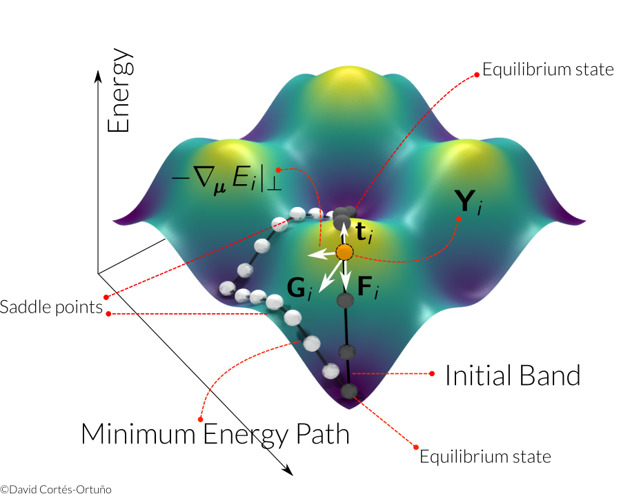
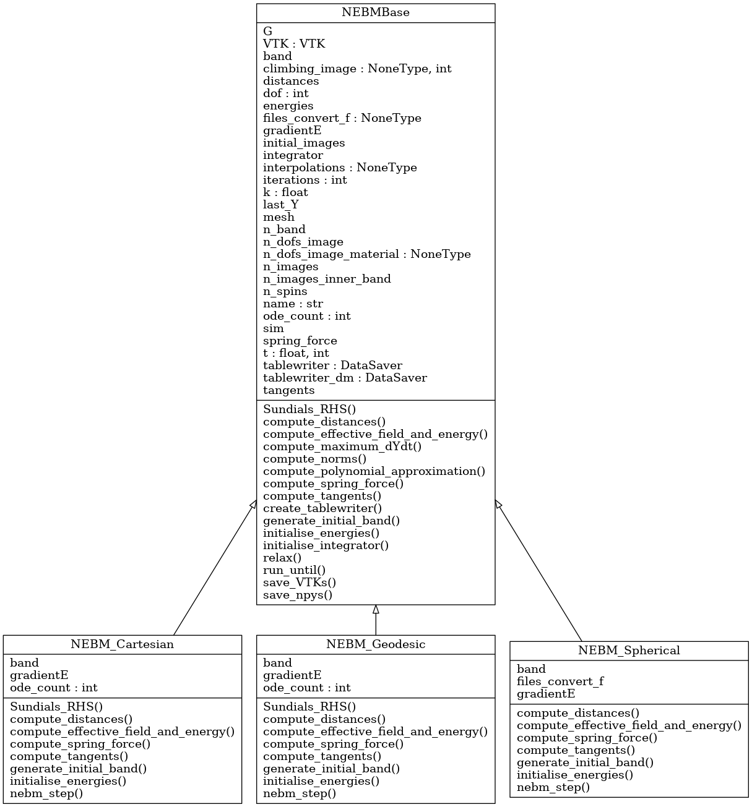

Nudged Elastic Band Method (NEBM)
=================================

The NEBM is an algorithm to find minimum energy transitions between equilibrium
states. This method was developed by Henkelman and Jónsson [1] to solve
molecular problems in Chemistry. Later, Dittrich et al. [2] applied the NEBM to
magnetic systems based on the micromagnetic theory. Recently, Bessarab et al.
[3] have proposed an optimised version of the NEBM with improved control over
the behaviour of the algorithm. Their review of the method allows to apply the
technique to systems described by either a micromagnetic or atomistic model.

The algorithm is based on, firstly, generating :math:`N` copies of a magnetic
system that we describe by :math:`P` spins or magnetic moments arranged in a
lattice or mesh.  Every copy of the system, is called an *image*
:math:`\mathbf{Y}_{i}`, :math:`i\in \{0,\ldots,P-1\}` and we specify an image
using the spins directions in a given coordinate system. For example, in
Cartesian coordinates we have

.. math::
    \mathbf{Y}_{i} = \left( s_{x,0}^{(i)}, s_{y,0}^{(i)}, s_{z,0}^{(i)}, s_{x,1}^{(i)}, 
                     s_{y,1}^{(i)},\ldots, s_{y,P-1}^{(i)}, s_{z,P-1}^{(i)}   
                     \right)

for a system described by a discrete spin model. Within the micromagnetic model
we use :math:`\mathbf{m}` rather than :math:`\mathbf{s}`, but both are unit
directions.

This sequence of images defines a *band*, where every image is in a (ideally)
different magnetic configuration. The energy of the system depends on the
magnetic configuration (e.g. a skyrmion, vortex, uniform state,etc.), thus the
energy is parametrised by the number of degrees of freedom, which is
:math:`n\times P`, where :math:`n` is the number of coordinates to describe a
spin (e.g. :math:`n=3` for Cartesian coordinates and :math:`n=2` in Spherical
coordinates). Accordingly, every image will have a specific energy, i.e.
:math:`E=E(\mathbf{Y})`,  which determines the position of an image in an
energy landscape. The first and last images in a band are chosen as equilibrium
states of the magnetic system and they are kept fixed during the NEBM
evolution.

Secondly, to initiate the NEBM evolution, it is necessary to specify an initial
guess for the images, which means generating different magnetic configurations
between the extrema of the band. It is customary to use an interpolation of the
spins directions to achieve this.

And thirdly, the band is relaxed to find a path in energy space that costs less
energy. This path is characterised by passing through a saddle point, which is
a maximum in energy along certain directions in phase space, and this point
determines an energy barrier between the two equilibrium states. The energy
barrier is the energy necessary to drive one equilibrium state towards the
other. A first order saddle point is the one that is a maximum along a single
direction in phase space and will usually in the energy path that costs less
energy. It is possible that there are more than one energy paths.

It is also necessary to consider that:

* To distinguish different images in the energy landscape we need to define a
  *distance*

* To keep the images equally spaced to avoid clustering around saddle points or
  equilibrium states, we use a spring force between images.

* Spins or magnetic moments can be described in any coordinate system. The most
  commonly used are spherical and Cartesian coordinates. For the later we have
  to specify the constraint to fix the spin length.


For a thorough explanation of the method see references [3,4].


NEBM relaxation
---------------



Cartesian
^^^^^^^^^

When using Cartesian coordinates, every image of the band
:math:`\mathbf{Y}_{i}` is iterated with the following dynamical equation with a
fictitious time :math:`\tau`

.. math::
    \frac{\partial \mathbf{Y}_i}{\partial \tau} = -\gamma \mathbf{Y}_{i} \times
    \mathbf{Y}_{i} \times \mathbf{G}_{i} + c \sqrt{ \left( \frac{\partial \mathbf{Y}_{i}}{\partial \tau} \right)^{2} }
			\left( 1 - \mathbf{Y}_{i}^{2} \right) \mathbf{Y}_{i}

In this equation, :math:`\gamma` is in units of :math:`\text{Hz T}^{-1}` and it
determines the time scale, which is irrelevant here so we set :math:`\gamma=1`.
The second term to the right is necessary to keep the spins/magnetisation length
equal to one, using an appropriate factor :math:`c` that we set to 6. The :math:`\mathbf{G}`
is the total force on an image, which in the atomistic theory is defined as

.. math::
    \mathbf{G}_{i} =  - \boldsymbol{\nabla}_{\boldsymbol{\mu}} E(\mathbf{Y}_{i})|_{\perp} +
                 \mathbf{F}(\mathbf{Y}_{i})|_{\parallel}

and in the micromagnetic theory as

.. math::
    \mathbf{G}_{i} =  - \boldsymbol{\nabla}_{\mathbf{M}} E(\mathbf{Y}_{i})|_{\perp} +
                 \mathbf{F}(\mathbf{Y}_{i})|_{\parallel}

We use the magnetic effective field definition to evaluate the gradients, i.e. 
:math:`\boldsymbol{\nabla}_{\boldsymbol{\mu}}E=\partial E / (\mu_{s}\partial\mathbf{s})=-\mathbf{H}_{\text{eff}}`
or :math:`\boldsymbol{\nabla}_{\mathbf{M}}E=\partial E / (M_{s}\partial\mathbf{m})=-\mathbf{H}_{\text{eff}}`.
The perpendicular component is with respect to the tangents :math:`\mathbf{t}` to the energy band, thus
for a vector :math:`\mathbf{A}`

.. math::
    \mathbf{A}|_{\perp} = \mathbf{A} - (\mathbf{A}\cdot\mathbf{t})\mathbf{t}

The tangents are defined according to the energies of the neighbouring images [3]. The second term
to the right hand side of the equation for :math:`\mathbf{G}` is the spring force that
tries to keep images at equal distance and is defined using the distance between neighbouring
images

.. math::
    \mathbf{F}(\mathbf{Y}_{i})|_{\parallel}=k\left(|\mathbf{Y}_{i+1}-\mathbf{Y}_{i}|-
        |\mathbf{Y}_{i}-\mathbf{Y}_{i-1}|\right)\mathbf{t}_{i}

which is parallel to the band, i.e. in the direction of the tangent.

According to Bessarab et al. [3], the tangents and the total force
:math:`\mathbf{G}` must be *projected* into the spin/magnetisation tangent
space.

Climbing Image NEBM
^^^^^^^^^^^^^^^^^^^

The climbing image technique is a modification of the NEBM where the forces of
the image with largest energy in the band, are redefined so this image can
climb up in energy along the band to get a better estimate of the saddle point
energy [1,3]. The image with largest energy is chosen after relaxing the
band with the usual NEBM algorithm. The total force on this climbing image is

.. math::
    \mathbf{G}^{\text{CI}}_{i} =  - \boldsymbol{\nabla}_{\boldsymbol{\mu}} E(\mathbf{Y}_{i})|_{\perp} +
                 \boldsymbol{\nabla}_{\boldsymbol{\mu}} E(\mathbf{Y}_{i})|_{\parallel}

where the spring force was removed. The climbing image is still allowed to
climb down in energy in a direction perpendicular to the band, thus it is
possible that the energy barrier magnitude decreases after applying this
technique.

Vectors
-------

Following the definition of an image in Cartesian coordinates, we mentioned
that the number of degrees of freedom is :math:`n\times P`, where :math:`n` is
the number of coordinates to describe a spin. Accordingly, many of the vectors
in the NEBM algorithm such as the tangents, total forces, etc. have the same
number of components, which agree with the spin components of an image.

For instance, the total force (or tangents, spring forces, etc.) has three
components in Cartesian coordinates, corresponding to every spin direction:

.. math::
    \mathbf{G}_{i} = \left( G_{x,0}^{(i)}, G_{y,0}^{(i)}, G_{z,0}^{(i)}, G_{x,1}^{(i)}, 
                     G_{y,1}^{(i)},\ldots, G_{y,P-1}^{(i)}, G_{z,P-1}^{(i)}   
                     \right)

Projections
-----------

The projection of a vector into the spin/magnetisation tangent space simply
means projecting its components with the corresponding spin/magnetisation field
components. For example, for a vector :math:`\mathbf{A}` associated to the
:math:`i` image of the band (we will omit the :math:`(i)` superscripts in the
spin directions :math:`\mathbf{s}` and the :math:`\mathbf{A}` vector components)

.. math::
    \mathbf{A} = \left( \mathbf{A}_{0}, \ldots \mathbf{A}_{P-1}\right) = 
                 \left( A_{x,0}, A_{y,0}, A_{z,0}, A_{x,1}, A_{y,1},\ldots, A_{y,P-1}, A_{z,P-1} \right)

the projection :math:`\mathcal{P}` is defined as

.. math::
    \mathcal{P}\mathbf{A} = \left( \mathcal{P}_{\mathbf{s}_{0}}\mathbf{A}_{0}, 
                                   \mathcal{P}_{\mathbf{s}_{1}}\mathbf{A}_{1},
                                   \ldots
                                   \mathcal{P}_{\mathbf{s}_{1}}\mathbf{A}_{P-1},
                            \right)

where

.. math::
   \mathcal{P}_{\mathbf{s}_{j}}\mathbf{A}_{j} =  \mathbf{A}_{j} - 
                        \left( \mathbf{A}_{j} \cdot \mathbf{s}_{j} \right) \mathbf{s}_{j}

with :math:`j\in\{0,\ldots,P-1 \}`, hence

.. math::
    \mathbf{A} = \left( \mathcal{P}A_{x,0}, \mathcal{P}A_{y,0}, \ldots, \mathcal{P}A_{y,P-1}, \mathcal{P}A_{z,P-1} \right)


Distances
---------

There are different ways of defining the distance in phase space between two
images, :math:`d_{j,k}=|\mathbf{Y}_{j} - \mathbf{Y}_{k}|`. 

Geodesic
^^^^^^^^

The optimised version of the NEBM [3] proposes a Geodesic distance based on
Vicenty's formulae:

.. math::
   d_{j,k} = \sqrt{ \left( \delta_{0}^{(j,k)} \right)^{2} +
                    \left( \delta_{1}^{(j,k)} \right)^{2} + \ldots
                    \left( \delta_{P-1}^{(j,k)} \right)^{2}
                 }

where

.. math::
   \delta_{i}^{(j,k)} = \arctan2 \left( \left| \mathbf{m}_{i}^{(j)}\times \mathbf{m}_{i}^{(k)} \right|,
                                                \mathbf{m}_{i}^{(j)}\cdot \mathbf{m}_{i}^{(k)}
                                 \right)

This definition seems to work better with the NEBM since the spin directions
are defined in a unit sphere.

Euclidean
^^^^^^^^^

The first versions of the method simply used an Euclidean distance based
on the difference between corresponding spins. In Cartesian coordinates it reads

.. math::
   d_{j,k} = \frac{1}{3 P} \left\{ \sum_{j=0}^{P-1} \sum_{\alpha\in\{x,y,z\}}
                                        \left[ \left( s_{\alpha}^{(j)} - s_{\alpha}^{(k)}
                                               \right)^{2} 
                                        \right] 
                              \right\}^{1/2}

where we have scaled the distance by the number of degrees of freedom of the
system (or an image). In spherical coordinates the definition is similar, only
that we use the difference of the azimuthal and polar angles and the scale
is :math:`2P`.

Algorithm
---------

The algorithm can be summarised as:

1. Define a magnetic system and find two equilibrium states for which we want
   to find a minimum energy transition.

2. Set up a band of images and an initial sequence between the extrema. We can
   use linear interpolations on the spherical angles that define the spin
   directions [4] or Rodrigues formulae [3].

3. Evolve the system using the NEBM dynamical equation, which depends on the
   chosen coordinate system. This equation involves:
   
   I. Compute the effective field for every image (they are in different magnetic
      configurations) and the total energy of every image

   II. Compute the tangents according to the energies of the images and project them
       into the spin/magnetisation tangent space

   III. Compute the total force for every image in the band using the tangents
        and distances between neighbouring images. This allows to calculate the
        gradient (which uses the effective field) and the spring forces on the
        images

   IV. Project the total force into the spin/magnetisation tangent space

   V. Use the dynamical equation according to the coordinate system

Early versions of the NEBM did not project the vectors into the tangent space
in steps I and II. This leads to an uncontrolled/poor behaviour of the band
evolution since the vectors that are supposed to be perpendicular to the band
still have a component along the band and interfere with the images movement in
phase space.


Fidimag Code
============

We have implemented three classes in Fidimag for the NEBM:

1. `NEBM_Spherical`: Using spherical coordinates for the spin directions and
   Euclidean distances with no projections into spin space. The azimuthal and
   polar angles need to be redefined when performing differences or computing
   Euclidean distances, specially because the polar angle gets undefined when
   it is close to the north or south. It is not completely clear what is the
   best approach to redefine the angles and when to do this, thus this class
   currently does not work properly.

2. `NEBM_Cartesian`: Using Cartesian coordinates for the spin directions and
   Euclidean distances with no projections into spin space. This method works
   well for a variety of simple system. However, when the degree of complexity
   increases, such as systems where vortexes or skyrmions can be stabilised,
   the spring force interferes with the convergence of the band into a minimum
   energy path. For this case it is necessary to find an optimal value of the
   spring constant, which is difficult since the value depends on the system
   size and interactions involved.

3. `NEBM_Geodesic`: Using Cartesian coordinates for the spin directions and
   Geodesic distances, with vectors projected in tangent space. This is the
   optimised version of the NEBM [3] and appears to work well with every system
   we have tried so far. Cartesian coordinates have the advantage that they are
   well defined close to the poles of the spin directions.

The following diagram shows how the code is structured:



There is a ``fidimag.common.nebm_tools`` module with common functions for the
NEBM classes:

::

    fidimag.common.nebm_tools
    |
    --> cartesian2spherical
        spherical2cartesian
        compute_norm
        interpolation_Rodrigues_rotation
        linear_interpolation_spherical


Arrays
------

In fidimag we mainly use Numpy to define the NEBM vectors. When calling one of
the NEBM classes, we have to pass a ``sim`` object with the specification of
the magnetic system which has associated a ``mesh`` with ``n_spins``. According
to the coordinate system, we set the ``dof`` variable. For instance ``dof = 3``
for Cartesian coordinates. Consequently, we define the number of degrees of
freedom per image ``n_dofs_image = dof * n_spins``, thus if the NEBM
class was specified with ``n_images``, the total number of degrees of freedom
for the band is ``n_band = n_dofs_image * n_images``.

As explained in our discussion about the NEBM, we set up ``band``,
``gradientE``, ``tangents`` and ``spring_force`` arrays whose length is
``n_band``. The order is the same than how we defined the images, thus the
Numpy array, when using Cartesian coordinates to describe the spins, looks like

::

    band = [ s(0)_{x,0}  s(0)_{y,0}  ... s(0)_{z,n_dofs_image-1}
             s(1)_{x,0}  s(1)_{y,0}  ... s(1)_{z,n_dofs_image-1}
             ...
             s(n_images-1)_{x,0}  ... s(n_images-1)_{z,n_dofs_image-1}
           ]

and similarly for the other vectors since they follow the same order of the
spins. This ``band`` array is passed to the Cython codes to compute the NEBM
forces. Notice that we can easily redefine this array into a
``(n_images, n_dofs_image)`` shaped Numpy array using

::

    band = band.reshape(-1, n_dofs_image)

so every row is a different image. We can even take the inner images (no
extrema) and use the same piece of code since ``n_dofs_image`` does not change.


Cython Codes
------------

Most of the calculations are made using ``C`` code through Cython. The files
for these libraries are located in ``fidimag/common/neb_method/``. Every library
has a ``.c`` file, a ``.h`` header file and a ``.pyx`` Cython file (it can
differ in name from the ``C`` files)  which is compiled using Fidimag's
``setup.py`` file.

For example, there is a base module with common functions for every NEBM
class called ``nebm_lib.c``

::

    nebm_lib.c
    |
    --> compute_effective_force_C
        compute_norm
        compute_spring_force_C
        compute_tangents_C
        cross_product
        dot_product
        normalise
        normalise_images_C

Its corresponding header file ````nebm_lib.h`` contains the prototypes of these
functions. The Cython file that link some of these functions to the Python code
is called ``nebm_clib.pyx`` and can be called from the
``fidimag.extensions.nebm_clib`` library:

::

    fidimag.extensions.nebm_clib
    |
    --> compute_effective_force
        compute_tangents

The other ``.pyx`` or ``.c`` files use some of the ``nebm_lib.h`` functions.
They are separated according to the coordinate system used in the NEBM
calculations. The following diagrams show the Cython functions for these
libraries and the ``C`` files used to define them:

::

    nebm_cartesian_lib.c
    nebm_cartesian_lib.h
    nebm_cartesian_clib.pyx
    fidimag.extensions.nebm_cartesian_clib
    |
    --> compute_dYdt
        compute_effective_force
        compute_spring_force
        compute_tangents
        normalise_images
        project_images


    nebm_geodesic_lib.c
    nebm_geodesic_lib.h
    nebm_geodesic_clib.pyx
    fidimag.extensions.nebm_geodesic_clib
    |
    --> compute_spring_force
        geodesic_distance


    nebm_spherical_lib.c
    nebm_spherical_lib.h
    nebm_spherical_clib.pyx
    fidimag.extensions.nebm_spherical_clib
    |
    --> compute_spring_force
        normalise_images

Every library has its own ``compute_spring_force``, which is taken from the
``nebm_lib.c`` file, since the spring force depends on the
coordinate-system-dependent distance definition. For the Cartesian and
spherical coordinates, the distance functions (Euclidean distances) are not
exposed in the Cython file, as in the code for Geodesic distances.

Geodesic distances code
-----------------------

Based on the aforementioned NEBM algorithm, the class initialise the NEBM
calling the following methods in this order:

::

    1. generate_initial_band   # Using linear interpolations or Rodrigues rotation formulae    
    |
    --> nebm_tools.cartesian2spherical --> nebm_tools.linear_interpolation_spherical
        # or
        nebm_tools.interpolation_Rodrigues_rotation

    2. initialise_energies     # Fill the energies array
    3. initialise_integrator   # Start CVODE
    4. create_tablewriter      # To pass data into .ndt files per every iteration of the integrator

The linear interpolation function requires that the input array is in spherical
coordinates. 

To relax the band, we use CVODE, as specified in step 3., using the
``cvode.CvodeSolver`` (or ``cvode.CvodeSolver_OpenMP``) integrator. The
integrator requires a ``Sundials_RHS`` function that is called on every
iteration, which is the right hand side of the :math:`\partial \mathbf{Y} /
\partial \tau` dynamical equation. Correspondingly, this function
calculates the NEBM forces as

::

    Sundials_RHS
    |
    --> nebm_step
        |
        --> compute_effective_field_and_energy  # Gradient = - Eff field
                                                # Which we compute for every image
                                                # using the sim class
            compute_tangents
            |
            --> nebm_clib.compute_tangents      #
                nebm_cartesian.project_images   # Project tangents
                nebm_cartesian.normalise_images #
            compute_spring_force                # Using Geodesic distances
            nebm_clib.compute_effective_force
            nebm_cartesian.project_images(G)    # Project effective (total) force

        nebm_cartesian.compute_dYdt             # Add the correction factor to fix
                                                # the spins length to 1

Many methods come from the Cartesian Cython library ``nebm_cartesian`` since
the Geodesic class uses Cartesian coordinates to describe the spins. If a
climbing image was specified as an argument for the class, we compute its
modified force in the ``compute_effective_force`` method.

The function that iterates the integrator is the ``relax`` method. On every
iteration, we compute the difference with the previous step using a scaled
Euclidean distance.  The definitions of this process are specified in the
``compute_maximum_dYdt`` method from the ``nebm_base`` class. According to the
magnitude stopping criteria specified in the ``stopping_dYdt`` argument of
``relax``, the iterations of the integrator will stop if the difference with
the previous step is smaller than ``stopping_dYdt``.

Cartesian and spherical coordinates code
----------------------------------------

These classes follow the same process than the Geodesic distances code. The
main difference is that in the ``nebm_step`` process, the projections are not
performed and the distances are computed using the scaled Euclidean distance.

Spherical
^^^^^^^^^

For spherical coordinates, the vectors are smaller, with ``n_dofs_image = 2 * n_spins``,
where

::

    band = [ theta(0)_{0}  phi(0)_{0} theta(0)_{1} ... phi(0)_{n_dofs_image-1}
             theta(1)_{0}  phi(1)_{0} theta(1)_{1} ... phi(1)_{n_dofs_image-1}
             ...
             theta(n_images-1)_{0} ... phi(n_images-1)_{n_dofs_image-1}
           ]

The ``Sundials_RHS`` function does not include the correction factor since
spherical coordinates have implicit the constraint of fixed length for the
magnetisation. When computing distances or differences, it is necessary to
redefine the angles, but it is not completely clear the optimal way of doing
this.

.. [1] Henkelman, G. & Jónsson, H. *Improved tangent estimate in the nudged
   elastic band method for finding minimum energy paths and saddle points*. The
   J. Chem. Phys. 113, 9978–9985 (2000)

.. [2] Dittrich, R. et al. A path method for finding energy barriers and
   minimum energy paths in complex micromagnetic systems. J. Magn. Magn. Mater.
   250, 12–19 (2002).

.. [3] Bessarab, P. F., Uzdin, V. M. & Jónsson, H. *Method for finding
   mechanism and activation energy of magnetic transitions, applied to skyrmion
   and antivortex annihilation*.  Comput. Phys. Commun. 196, 1–37 (2015)

.. [4] Cortés-Ortuño, D. et al. *Thermal stability and topological protection of
   skyrmions in nanotracks*. Preprint at arXiv:1611.07079.
